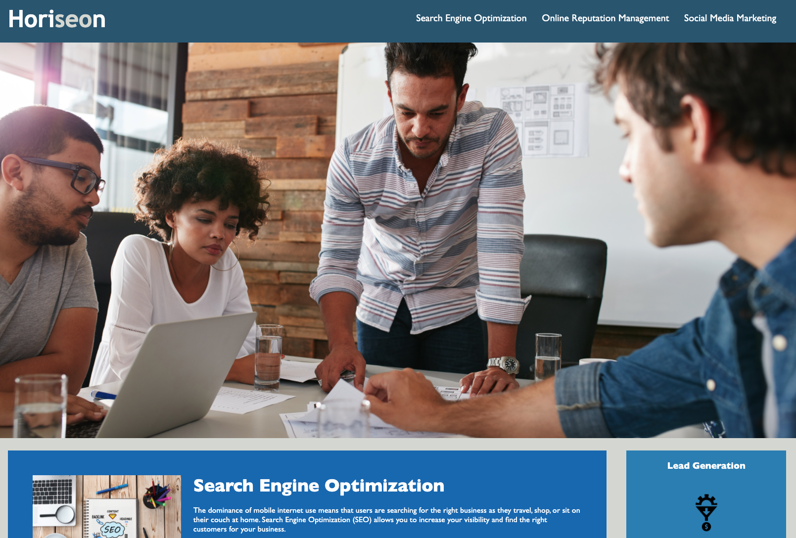

# Assignment: 01 HTML CSS Git: Code Refactor Overview

I refactored a codebase to Meet accessibility standards, Utilize proper semantic HTML elements, Ensured the elements follow a logical structure, Added accessible alt attributes, Ensure the heading attributes fall in sequential order and Edited the title element to a concise, descriptive title.

# Screenshot of Project

# Some examples of the HTML Edits I made were
Changed Title to Horiseon Social Solution Services  
Changed a "div" to "Header"  
Added a semantic element id="nav"  
Added a semantic element id="section"  
Added Title and Alt attributes to images  
Added a semantic element id="aside"  
Removed a closing "img"  
Changed a "div" to semantic element "footer"  

# The main CSS Edits I made were
Combining Classes that were redundant